# Blogrum
## Portfolio Project 4

This project is built as part of the Code Institute Full Stack Software Development course. The Blogrum Website is a combination of a Blog and Forum, It's a social network of blogs, where you can see all the posts for all blogs on the homepage or you can go into individual profiles and see a list of all their posts.

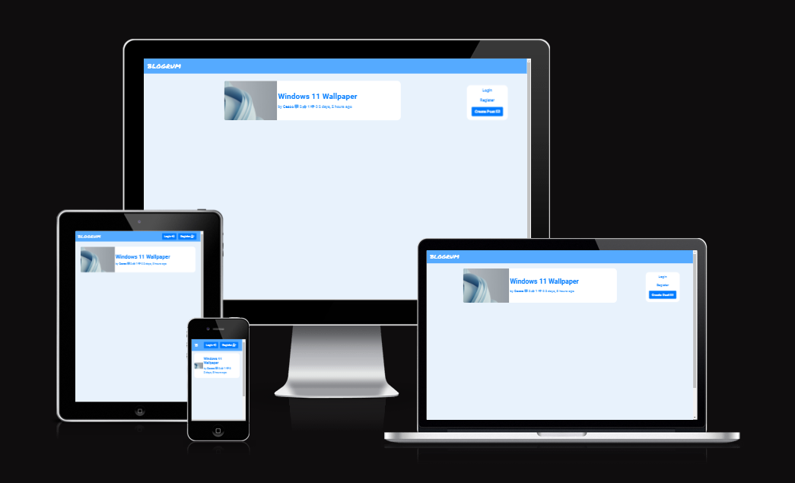
### [Blogrum](https://blogrum.herokuapp.com/)

### [Github Repository](https://github.com/FRNBDN/project4)

# UX

## Website Goals

The main use of the website is to provide a platform that is a cross between a blog and a forum. On the website users can post posts aswell as discuss them in the comments. Each user also has control over their own posts and comments, so they may delete and edit them as they need to. You can also see all your or other users posts on the respective profiles.

## Target Audience

The target audience for this website are people who wishes to post and discuss any kind of topic, the website has no specific demographic it tries to cater to, but rather just a platform where discussions and posting of interesting things can be done. The users of the website will determine the demographic based on the content it's being used for

## User Stories

User stories were brainstormed on my own, with having a website like reddit and other types of similar forums in mind. Thes structure of the user stories are as follows:

* title
* clear description

In the picture below you can see an example of the project board as the items have been finished off.

[Link to the final board](https://github.com/users/FRNBDN/projects/3/views/1), there are three items that was left out. The reason for them not being completed as they were deemed not essential for the project.

## Structure of the website

The Website is designed to have all the most recent posts show up on the homepage, and easy navigation between all pages without having information overlaod at the same time, so there are plenty of links to profiles/posts and what not without having too many things on the screen at once. Each page is also designed for one feature, to keep each page focused on it's designed task.

## Database Diagram

The database diagram was created with an online diagram tool in Lucid Charts. Here the link between the different models are clearly laid out and planned out as shown in the image below.

Database diagram:

## Models

Account Model

The account model used in the project is a custom user model that overrides the Basic Django User Model, it changes the login field from the username to the email. The model also handles the creation of the super user. 
* Has email & password fields for signing
* Username field for display name

The Post model:

* has a slug parament to be used in the url/as an id for the post
* author has a foreign key relationship with the user model.
* thumbnails are stored in Cloudinary via a CloudinaryField.
* Has a listed value, to allow admins to unlist any post with questionable material before reviewing it and potentially deleting it.
* Likes & dislikes as ManyToMany fields

The Comment model:

* has foreign key relationships with the user model and the post model.
* has a foreign key relationship with it's parent commment, used for comments that are replies to other comments.

## Color Scheme

The colors that were used for the website were largely blue, this is because blue conveys a calm and intellegent emotion, since this wesbite is going to be centered around discussions, having colors that reflect more calm and serene emotions rather than more agression was the option.

## Features

All the features divided into the different pages.

### Nav elements
The nav elemnt has two forms, one for big screens and one for smaller screens, the big screen nav has a sticky side bar and the smaller one puts these elements into the top bar.
Whats included are the links tot he different pages, such as the logged in users profile, along with users history; lifetime posts, comments, likes and dislikes. Other than that it shows logout and create post, create post is on the nav element since its a blog/forum website we want the create post link to be accessible at all times.

If the user is an admin then a link to the admin page is provided here too, easily accessible if they happen to spot something that needs administation. When not logged in the sidebar still shows the create post, however on the smaller screens the decision was to remove it to conserve space. But it redirects you to a screen prompting you to log in.

Nav for smaller screens

Nav for larger screens

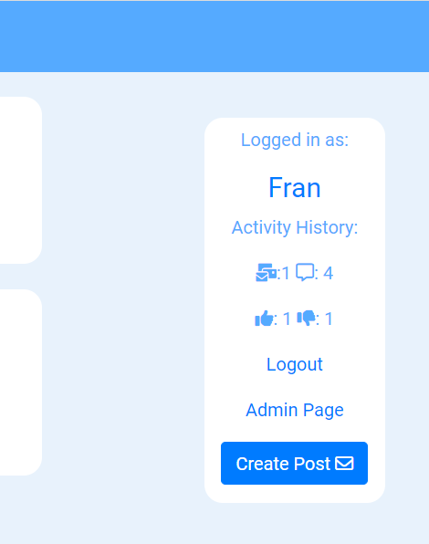
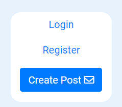

Promt to be logged in if try to create post

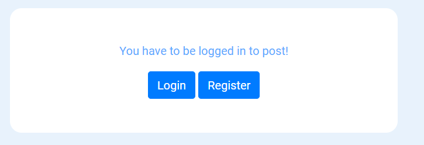

### Main Page/Feed
The main page is a list of all the posts that have been made to the website, ordered by recency. Each post generates a card that displays the thumbnail, title, author, likes/dislikes/comments and time posted aswell as edit/delete for the owner of the post. Clicking on the image or the title redirects you to the posts detailed view, while clicking on the author to redirects to the profile of the author. The edit/delte links redirects to the edit posts form and the confirm delete respectively.

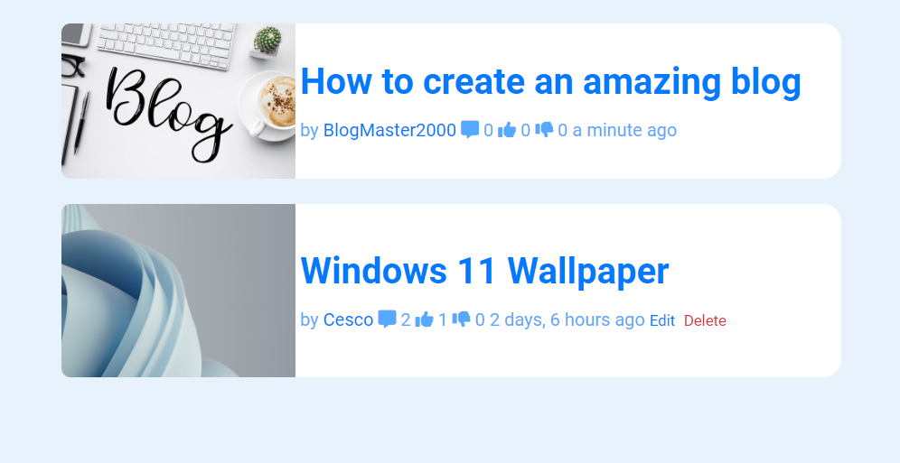

Although the image doesn't show it, the page is paginated by 10, and when that is reached there is a pagination nav in the bottom of the page.

### Account Profiles
The profile page is both a user settings page and a profile page, meaning that if you are the owner of the page then you will get the account settings card showing up on top as in the image below, and if you are not then you will only be seeing the bottom card.

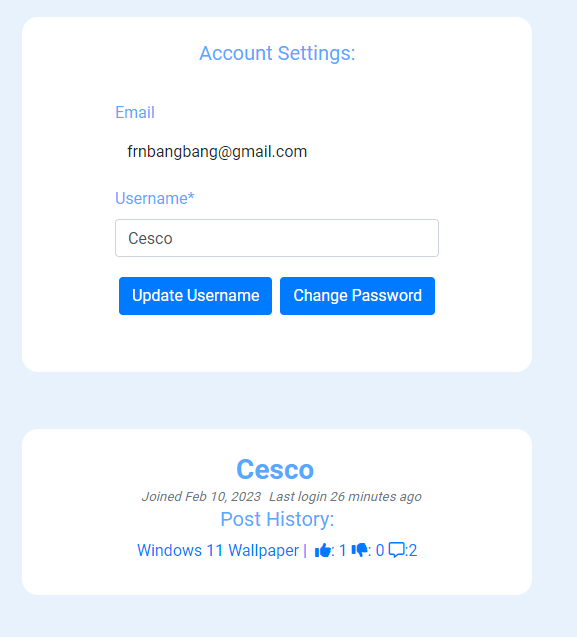

The account card shows you your email adress and your username, the username and its button is a form, so you can update it right from this page by altering your username and clicking the update button, the pagg will then update and display your new username. The email adress is not in a textbox to indicate that it cant be changed. The password button redirects you to a password change form on a separate page. Image below shows the page after updating your username, the textbox and other elements in the ui also serves as the confirmation that the user has changed its username.

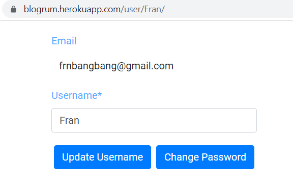

Lastly the profile information that is public displays the profile you're viewings Username, joined date, and last login, then the Post history and interactions with the post. Clicking the post links to the detailed view of the post.

### Post Detail
The post detail is where the users can interact with the posts, such as dislike,like and comment, the comment section also allows for replies. The page is dividied into two sections, the post card and the comment card.

On the post card you will find the image, author, time posted, likes, dislikes, post itself, as shown in the image below. The like/dislike split button has an active tag for the one that you have, making it darker to indicate that you have already clicked it. if you were to click the opposite one it will remove your like/dislike and apply the opposite from just the one click/ the autho is linked to its correspoding profile page. 

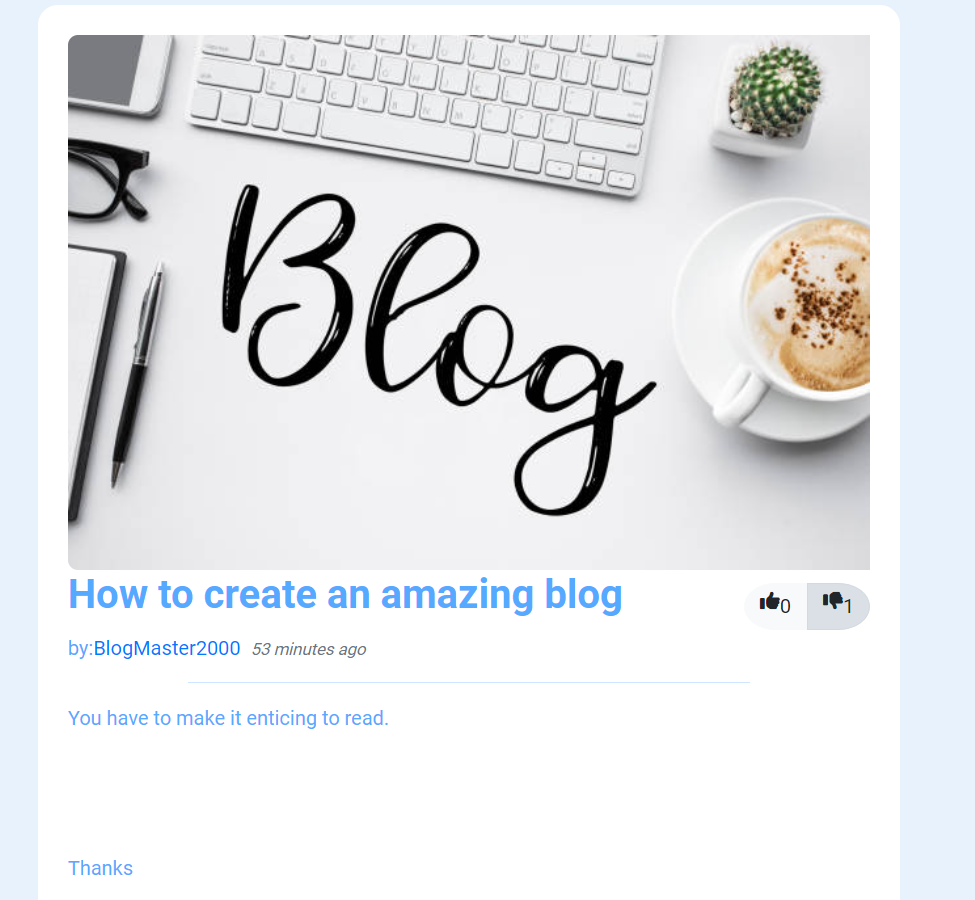

How the wesbite displays edited posts

The not logged in likes/dislikes looks as follows: 

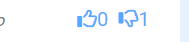

Just like for the feed, the edit/delete links are here when youre the owner of the post

### Comment Section
On the comments card there is a header showing the total number of comments, and a comment form that lets you leave a comment, it also tells you want account you're logged in to for clarity. The comments are then displayed below, the comment section is modeled after reddits in that it allows for replying to comments, and when you do so it will be indented and essentially it renders another comment thread inside the comment div, shown in the picture below. As a logged in suer you see the reply link, as the commenter of the comment you see the edit/delete buttons.

Empty comment section

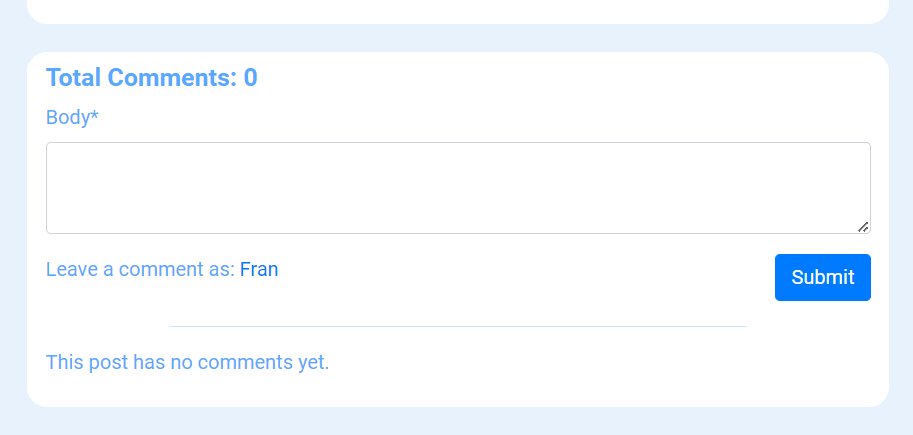

Comment section with a comment and a reply

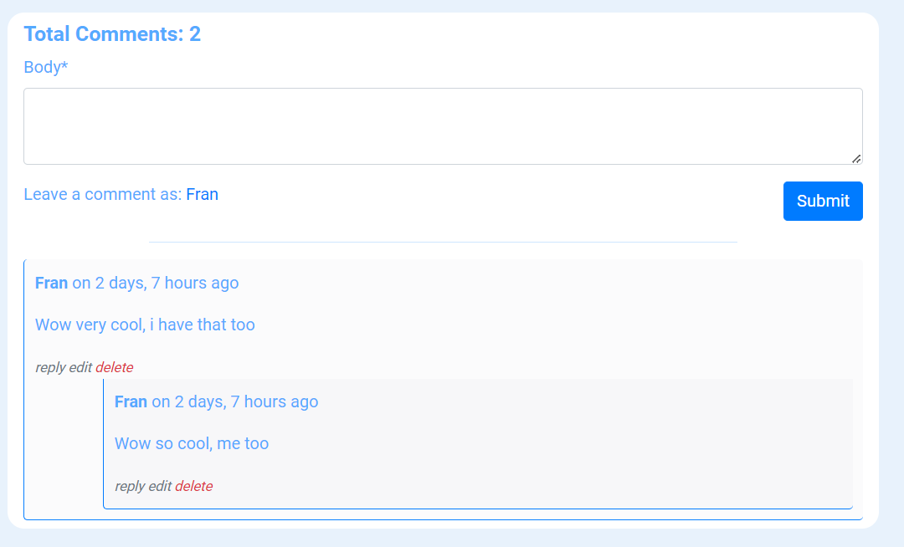

Comment section when logged out

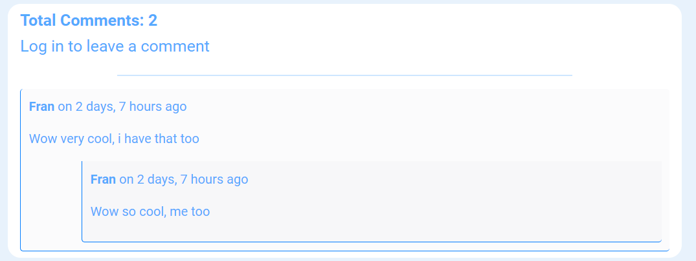

How the wesbite displays edited comments

Reply form after you press the reply link, pressing it again will make it disappear again

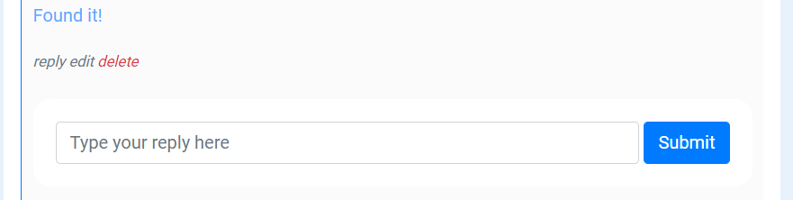

### Post Edit/Create
The post edit/create is the same form but with different title and button on the top and bottom. Here are two examples. Worth noting is that on the edit bottom, there is "no file chosen" just like in the create, but this is to indicate that the image will remain the same as before.
Create post examples

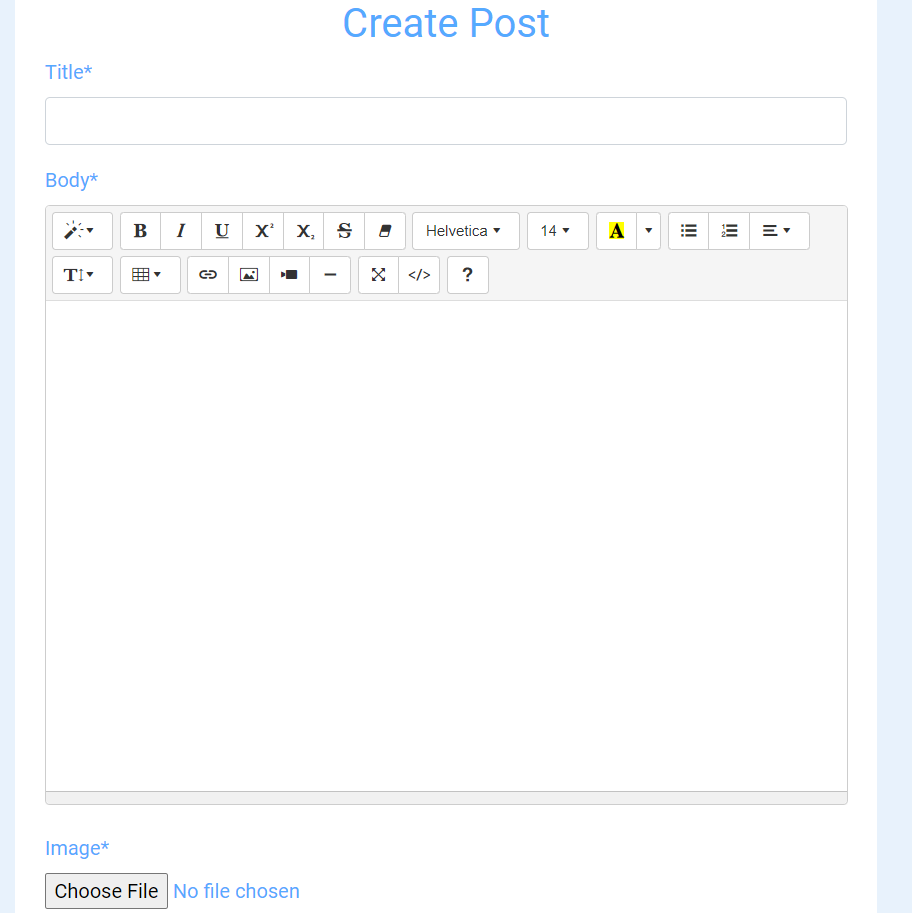
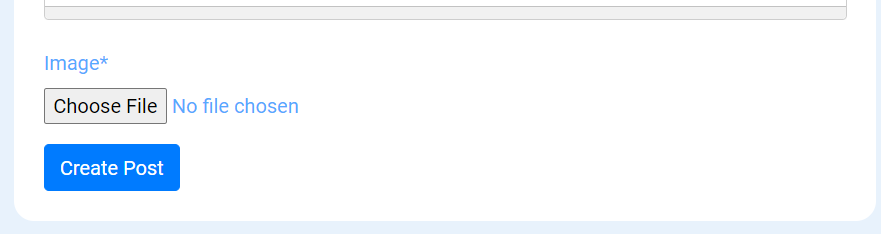

Edit post examples

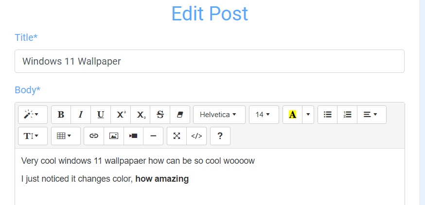
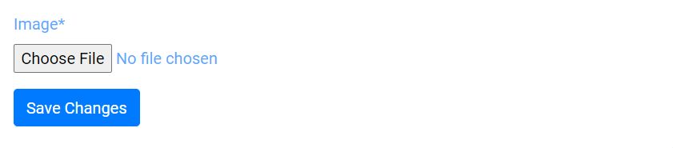

Post without image

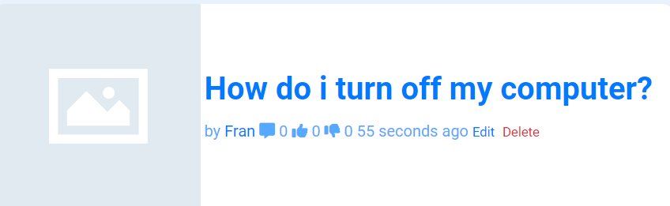

### Post Delete Confirm
When trying to delete a post you get redirected to this screen:

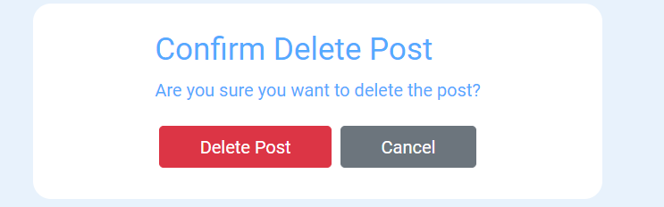

Which in turn redirects you to home page when clicking the delete post button, 
the cancel button returns you to the page that you were on previously.

### Comment Edit
When editing a comment you arrive at the comment edit screen, here you get to alter the message of your comment adn then press update, 
you may cancel at any time, and the button works the same as for the Post Delete Confirm screen. Update redirects you to the post.

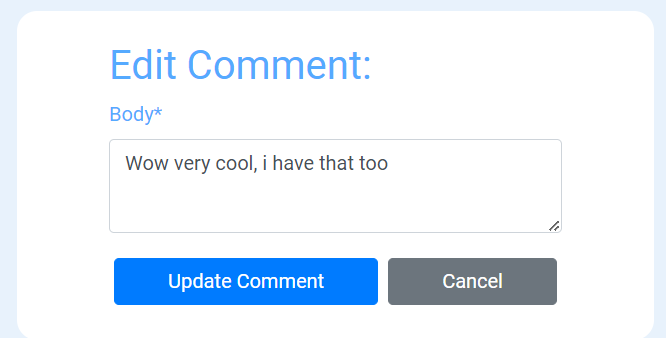

### Comment Delete Confirm
Same as post delete but for comment. Only difference is that the redirect is to the post detail of the comment.

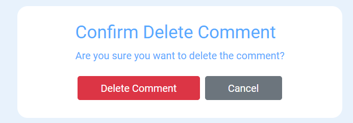

### Footer
The footer is a simple sticky footer that always loads off screen by making the main section 100vh.

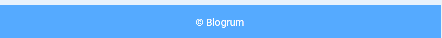

### Login
Login Redirects to home and logs in the user when successful, and there are links to the register page and the forgot password page below the form.

Login Screen

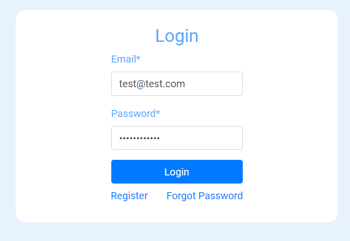

Login Error

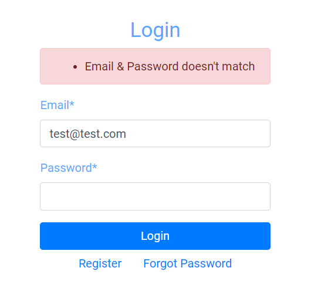

### Logout
Logout simply logs out the user and redirects to home when pressed

### Register
Register screen has an email, username and 2 password fields, the username and email are checked to see that they are not already in use. The password has a number of cirteria listed inbetween the to password fields. 'Already have an account?' links back to login page.

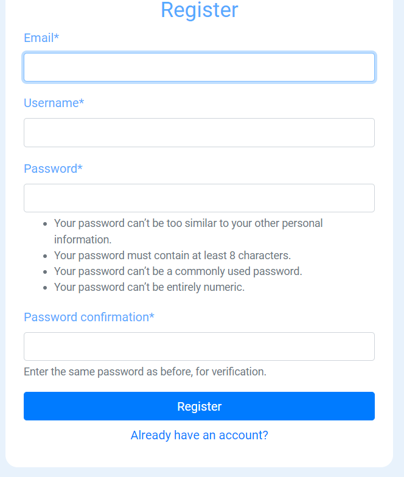

### Password Recovery
When clicking forgot password on the login screen you get to the password recovery screen.

Here you enter your email and you will receive a email to reset your password, link to home is avaialble. Below is the reset pass screen, email that has been sent and the success screen

Reset screen

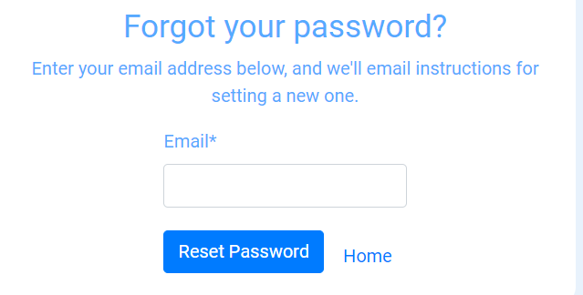

After pressing reset password

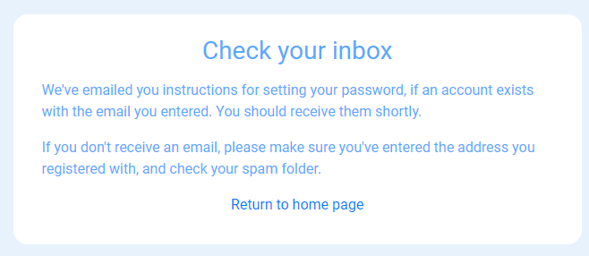

Email that is sent out 

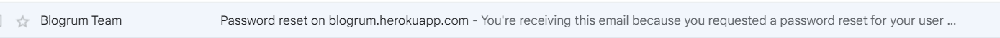

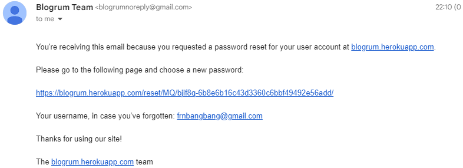

The email link sends you to the page below, I couldnt get the email or this page to take my templates over the standard templates provided in django.

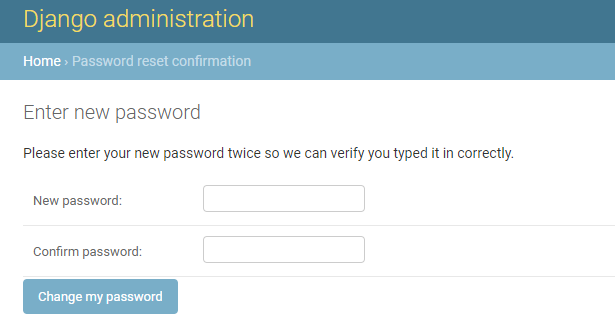

### Password Update
Password update is accessed through your profile page when logged in. This is the form:

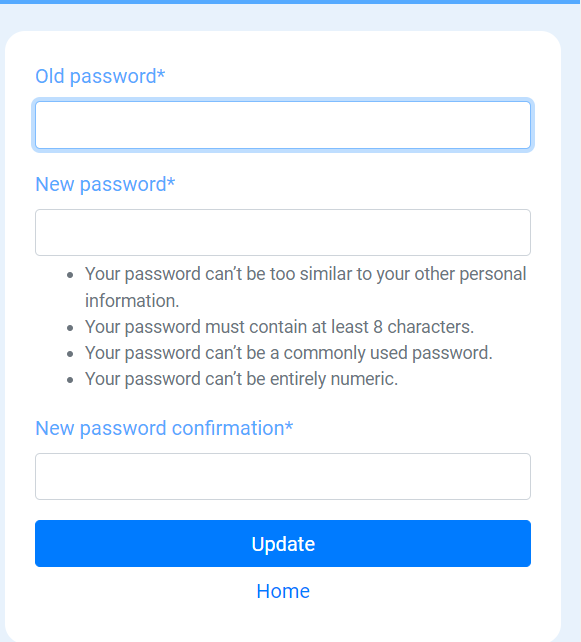

### Admin
As an admin you have access to all comments, posts and accounts. You have the ability to edit, create or delete posts/comments/accounts from here and anything you might need as an administrator of this blog/forum website.

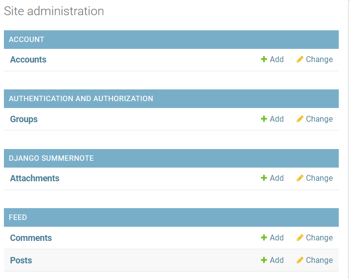

Here is how the admin displays accounts, with clear view of all the options available to the admin.

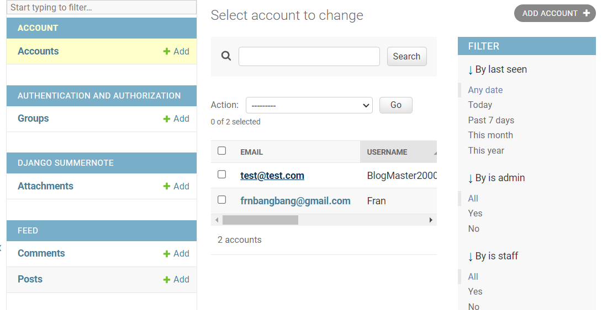

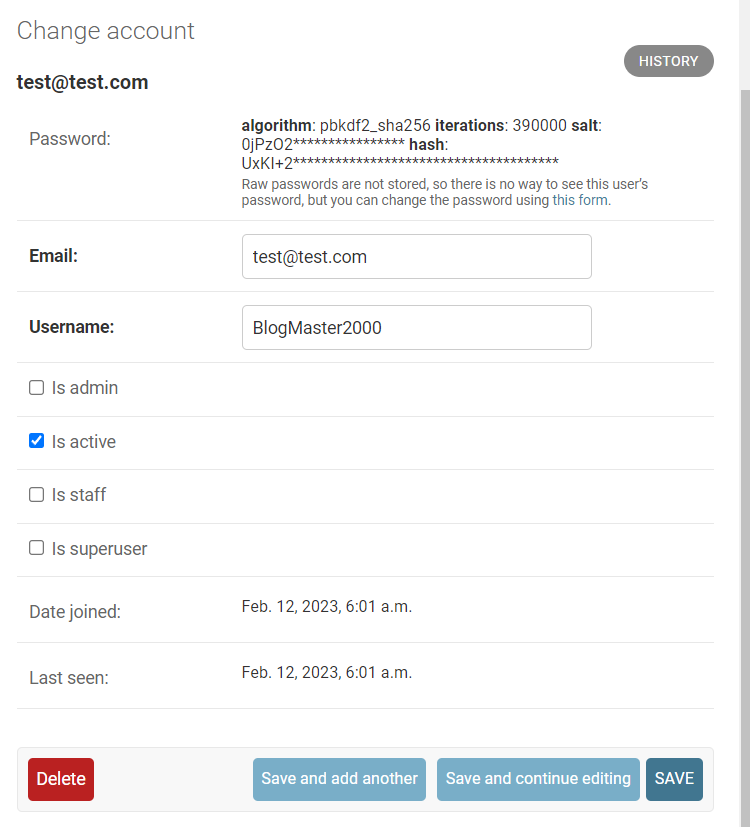

Here is post admin
List of potsts

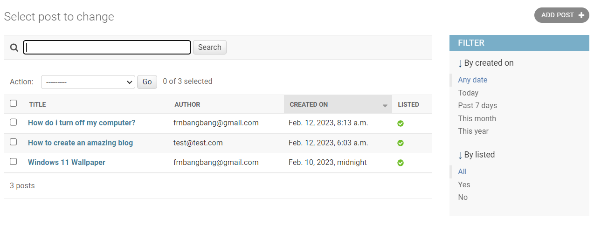

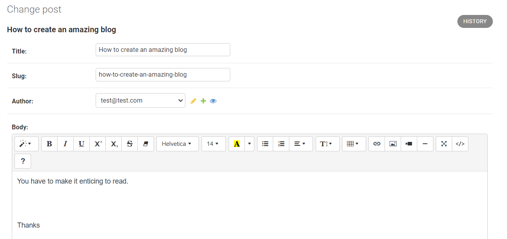
Here below the admin can decide to delist the post, but this delists it from the main feed,
This can only be done by admins, but you can still access the post on the users post history, this can be used to limit bandwagoning towards unpopular opinions. Obviously not the best solution(given that it removes reach for the post), but better than nothing.

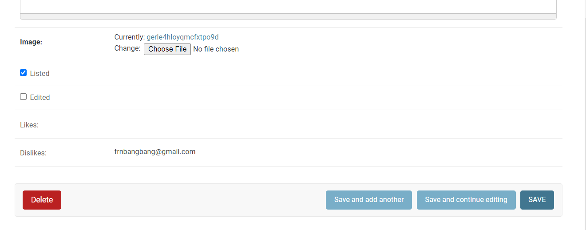

## Future Features
Features that were left out are listed below in no particular order. Seeing as the website is very broad in scope, there are plenty of features that could be implemented in the future.

### Comment Indentation Update
The comment indentation has its flaws, as if enough replies gets stacked together eventually they will become so narrow that only 1 letter shows per row. This can be fixed to have a more dynamic way indenting and visually show that they are replies. Color coding the left border is an option too.

### Comment Likes/Dislikes
This, the one above and below could be a full comment enhancement done together.

But this one was left out from the project, althugh the backend models have support for these already. So adding these as a future feature is obvious.

### Comment Cascade on delete to Protect

Having the comments that are replies protected if the parent comment gets deleted, currently they cascade. Its possible that great discussions might be deleted because they happened inside a reply, this would rectify that.

### Searchbar

Adding a searchbar so you can find posts you saw a long time ago without having to scroll through all posts since then.

### Follow profiles
Adding the ability to follow profiles and having a feed of only posts from followed profiles as an option on the homepage.

### Ordering based on feedback

Odering posts and comments based on likes/dislikes, maybe counting each like as +1hour and dislike -1hour in the ordering as a very simple algoithm.

# Credits

### Code Resources
Resources used for fixes, inspiraiton and knowledge.

[Stack Overflow](https://stackoverflow.com)

Code Institute I Think Therefore I Blog  - Walkthrough

[Youtube](https://youtube.com)

[Django Docs](https://www.djangoproject.com/)

[Bootstrap Docs](https://getbootstrap.com/)

### Images

The images on the website are posted by the users, it is the users responsibility to ensure that they are not infringing on any copyright. Blogrum is not responsible for any copyrighted material posted on our website.

If you own the right of material posted on the webiste and you wish for it to be removed, please get in touch!

### Technologies used

[HTML](https://html.spec.whatwg.org/) - for the structure of the website and mocking of the terminal (written by Code Institute)

[HTMLemail/inline](https://htmlemail.io/inline/) - for making the email html template into inline html.

[CSS](https://www.w3.org/Style/CSS/Overview.en.html) - to provide styling to the page.

[JavaScript](https://developer.mozilla.org/en-US/docs/Web/JavaScript) - for the structure of the website and mocking of the terminal (written by Code Institute)

[Python](https://www.python.org/) - to write all the logic of the app

[Django](https://www.djangoproject.com/) - used as main framework for the app, which both all backend and most frontend elements are built on. The following notable libraries/packages were added to django:

* cloudinary: for saving images in cloudinary and serving them to the client.
* django-crispy-forms: for making the django forms look better.

[ElephantSQL](https://www.elephantsql.com/) - used to manage a PostgreSQL database.

[Bootstrap](https://getbootstrap.com/) - used to style the brunt of the project.

[Gitpod](https://www.gitpod.io/) - used to connect a browser based VScode to github.

[Github](https://github.com/) - used for deployment of the website.

[UI.DEV Amiresponsive](https://ui.dev/amiresponsive) - to create the different devices responsivness image in the beginning of the file

[Lucidchart](https://www.lucidchart.com/pages/) used to make a database diagram.

[Heroku](https://dashboard.heroku.com/) - to deploy the app.

[W3C Validator](https://validator.w3.org/#validate_by_uri) - used to validate HTML.

[W3C Jigsaw Validator](https://jigsaw.w3.org/css-validator/) - used to validate CSS.

[UI.DEV Amiresponsive](https://ui.dev/amiresponsive) - to create the different devices responsivness image in the beginning of the file..

# Testing

All features of the website were tested to ensure that they work properly, the documentation of the testing has been made in a separate [testing document](TESTING.md).

## Security Features and Defensive Design

### User authentication
- Custom modles of djangos base user model was used for authentication functionality
- Django super user is used to limit access to the admin panel.

### Form Validation
All forms are checked on the frontend and/or the backend.

### Database Security
The steps taken are as follows:
- Every form in the project uses a CSRF(Cross-Site Request Forgery) Token.
- All secret keys are stored in a separate env.py file that is only kept locally and in config variables on the hosting platform, never published.

## Deployment
The deployment was done in largely two parts. 
1. After starting my django app I deployed the then empty project to Heroku to ensure that everything was done properly well in advance to the production deployment, to avoid any potential deadline issues if there were to occur issues while deploying. 
2. The latter being the full deployment

### Production Deployment
The deployment consists of creating and linking up the heroku app and connecting it to the ElephantSQL Database. 

After creating my django app I deployed the then empty project to Heroku to ensure that everything was done properly well in advance to the production deployment, to avoid any potential deadline issues if there were to occur issues while deploying. 

#### Create Heroku app:
1. Log in to Heroku.
2. Create the app in the dashboard by clicking "New" and "Create new app" in the dropdown
3. Name the app, choose the region closes to you and click create app.

#### Create a image hosting platform with Cloudinary:
1. Create a cloudinary account.
2. Copy the API environment password to use as a config variable down below

#### Create email to send out password reset through Gmail
1. Create a gmail adress 
2. Go to manage account > security 
3. Add 2-step Verification to the account
4. Select "other" from the dropdown Name the app
5. Copy the password to use as a config variable down below

#### Create ElephantSQL Database:
1. Log in to ElephantSQL.
2. Create the database isntance in the dashboard by clicking "Create new instace"
3. Name the app, choose the plan and click choose region.
4. Choose region, closes to you, click review.
5. Click Create instance.
6. Navigate to the detaisl apge database you created
7. Copy the value of the URL column, (postgres://.....) to use as a config variable down below

#### Connect ElephantSQL Database to Heroku App:
1. Open the your on the Heroku Dashboard
2. Navigate to the Settings tab and go to config vars, reveal them
4. Add Config Vars Key: DATABASE_URL Value: URL from elephantSQL

#### Deploy App on Heroku:
1. Go to Settings > Config Vars > Reveal Config Vars
2. Add a SECRET_KEY Variable
3. Add the CLOUDINARY_URL Variable from the cloudinary account dashboard
4. Add the EMAIL_HOST_PASSWORD Variable from the gmail app password
5. Under Deployment method select github and choose the correct repository.
6. Scroll down to Deploy and deploy the project.