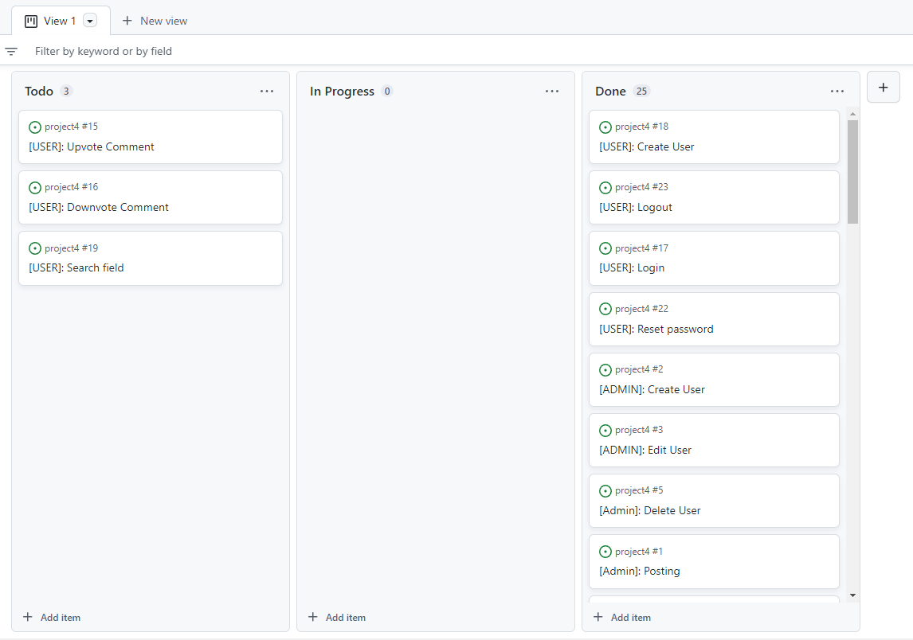

# Blogrum
## Portfolio Project 4

This project is built as part of the Code Institute Full Stack Software Development course. The Blogrum Website is a combination of a Blog and Forum, It's a social network of blogs, where you can see all the posts for all blogs on the homepage or you can go into individual profiles and see a list of all their posts.

### Live Site

[Blogrum](https://blogrum.herokuapp.com/)
### Github Repository

[Project4](https://github.com/FRNBDN/project4)
## UX

### Website Goals

The main use of the website is to provide a platform that is a cross between a blog and a forum. On the website users can post posts aswell as discuss them in the comments. Each user also has control over their own posts and comments, so they may delete and edit them as they need to. You can also see all your or other users posts on the respective profiles.

### Target Audience

The target audience for this website are people who wishes to post and discuss any kind of topic, the website has no specific demographic it tries to cater to, but rather just a platform where discussions and posting of interesting things can be done. The users of the website will determine the demographic based on the content it's being used for

### User Stories

User stories were brainstormed on my own, with having a website like reddit and other types of similar forums in mind.

* title
* clear description

In the picture below you can see an example of the project board as the items have been finished off.

[Link to the final board](https://github.com/users/FRNBDN/projects/3/views/1), there are three items that was left out. The reason for them not being completed as they were deemed not essential for the project.

### Structure of the website

The Website is designed to have all the most recent posts show up on the homepage, and easy navigation between all pages without having information overlaod at the same time, so there are plenty of links to profiles/posts and what not without having too many things on the screen at once. Each page is also designed for one feature, to keep each page focused on it's designed task.

### Database Diagram

The database diagram was created with an online diagram tool in Lucid Charts. Here the link between the different models are clearly laid out and planned out as shown in the image below.

Database diagram:

### Models

Account Model

The account model used in the project is a custom user model that overrides the Basic Django User Model, it changes the login field from the username to the email. The model also handles the creation of the super user. 
* Has email & password fields for signing
* Username field for display name

The Post model:

* has a slug parament to be used in the url/as an id for the post
* author has a foreign key relationship with the user model.
* thumbnails are stored in Cloudinary via a CloudinaryField.
* Has a listed value, to allow admins to unlist any post with questionable material before reviewing it and potentially deleting it.
* Likes & dislikes as ManyToMany fields

The Comment model:

* has foreign key relationships with the user model and the post model.
* has a foreign key relationship with it's parent commment, used for comments that are replies to other comments.

### Color Scheme

The colors that were used for the website were largely blue, this is because blue conveys a calm and intellegent emotion, since this wesbite is going to be centered around discussions, having colors that reflect more calm and serene emotions rather than more agression was the option.

### Features

The main features of the app are as follows

#### Main Page/Feed

#### Account Profiles

#### Post Detial

#### Nav bar 

#### Post Edit/Create

#### Comment Edit

#### Comment Section

#### Footer

#### Login/Logout

#### Register

#### Account Update

#### Account Recovery

#### Admin

### Future Features

#### Comment Upvote/Downvote

#### Searchbar

#### Following Users

## Credits

### Code

### Images

### Technologies used

[HTML](https://html.spec.whatwg.org/) - for the structure of the website and mocking of the terminal (written by Code Institute)

[HTMLemail/inline](https://htmlemail.io/inline/) - for making the email html template into inline html.

[CSS](https://www.w3.org/Style/CSS/Overview.en.html) - to provide styling to the page.

[JavaScript](https://developer.mozilla.org/en-US/docs/Web/JavaScript) - for the structure of the website and mocking of the terminal (written by Code Institute)

[Python](https://www.python.org/) - to write all the logic of the app

[Django](https://www.djangoproject.com/) - used as main framework for the app, which both all backend and most frontend elements are built on. The following notable libraries/packages were added to django:

* cloudinary: for saving images in cloudinary and serving them to the client.
* django-crispy-forms: for making the django forms look better.

[ElephantSQL](https://www.elephantsql.com/) - used to manage a PostgreSQL database.

[Bootstrap 5.2](https://getbootstrap.com/) - used to style the brunt of the project.

[Jquery](https://jquery.com/) - to make DOM manipulation a bit less painful.

[Lucidchart](https://www.lucidchart.com/pages/) used to make a database diagram.

[Gitpod](https://www.gitpod.io/) - used to connect a browser based VScode to github.

[Github](https://github.com/) - used for version control and deployment of the website.

[Heroku](https://dashboard.heroku.com/) - to deploy the app.

[JShint](https://jshint.com/) - used to validate javascript.

[NuHtmlChecker](https://validator.w3.org/nu/) - used to validate HTML.

[Multi Device Website Mockup Generator](https://techsini.com/multi-mockup/index.php) - to create an image of the website shown on different devices.

## Testing

## Security Features and Defensive Design

### User authentication

### Form Validation

### Database Security

## Deployment

### Local Deployment

### Production Deployment Initial

#### Create Heroku app:

#### Connect Postgres Database:

#### Deploy App on Heroku:

### Production Deployment Update

#### PostgreSQL database:

## Acknowledgements
