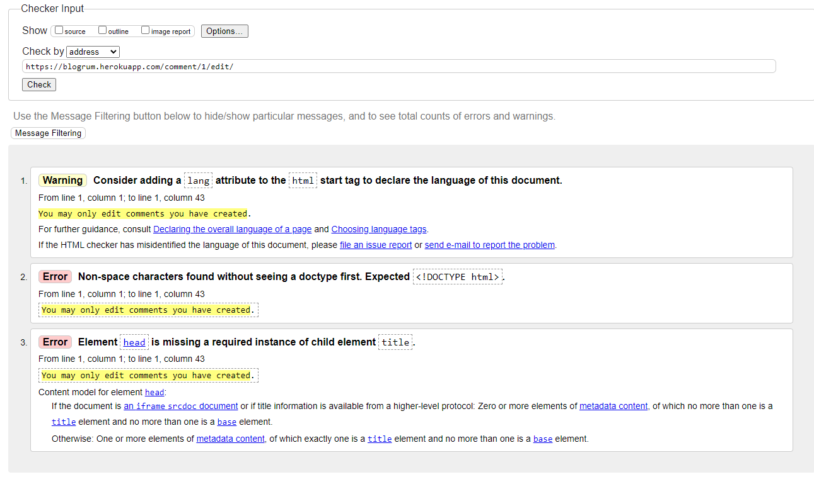

## Validator Testing

### HTML

All HTML pages were run though the [nu-html-checker](https://validator.w3.org/nu/). Below are the errors that came up.

#### Missing Head, 

The Warning and Errors that occur on this page was due to the view returning a httpresponse with plain text if the logged in user and owner of the post doesn't match., which resulted in it not extending the base.html template. The issue was resolved by altering the view to make the error message show up in uniform styling with the rest of the page.

#### Element ul not allwoed as a child of element small ...

This error is on the register page, is due to rendering django forms, perhaps with crispy. But the error is on the password validation criteria on the form. The issue was not resolved as it is not throwing any errors, and it is displaying as expected.

### CSS

The CSS file validator used was the [W3C CSS Validator](https://validator.w3.org/nu/) and it found no errors in my css

### Python

Auto PEP8 was installed and used throughout the project, all issues were fixed as they appeard, no problems other than these

### Lighthouse

Lighthouse was used on all pages. Here are the scores:

Login Page

Register Page

Post Detail Page

Profile Page

Home Page

Edit post Page

Delete post Page

Create post Page

Edit comment Page

Delete comment Page

## Browser Testing

The project was tested on Google Chrome, Edge and Safari. no compatability issues cam up and everything works as expected.
## Device Testing

The project was tested thoroughly with the developer tools in the chrome browser, testing a wide variety of screen sizes. In addition the project was tested on a large foldable android device(cover screen and inside screen) and an iPhone and the website was fully reponsive on all.

## Manual Testing

### Site Navigation
#### When not logged in
| Element               | Action     | Expected Result                 | Pass/Fail |
|-----------------------|------------|---------------------------------|-----------|
| Logo in Navbar        | Click      | Redirect to home                | Pass      |
| Login button          | Click      | Redirect to login page          | Pass      |
| Register button       | Click      | Redirect to register page       | Pass      |
| Create post button    | Click      | Redirect to login prompt        | Pass      |

#### When logged in
| Element               | Action     | Expected Result                     | Pass/Fail |
|-----------------------|------------|-------------------------------------|-----------|
| Logo in Navbar        | Click      | Redirect to home                    | Pass      |
| Account  Link         | Click      | Redirect to user profile            | Pass      |
| Logout button         | Click      | Redirect to home and logs out user  | Pass      |
| Create Post button    | Click      | Redirect to Create post form        | Pass      |

#### + When logged in as admin
| Element               | Action     | Expected Result                    | Pass/Fail |
|-----------------------|------------|------------------------------------|-----------|
| Admin page button     | Click      | Redirect to admin page             | Pass      |

### Home Page / Feed
#### When not author
| Element               | Action  | Expected Result                 | Pass/Fail |
|-----------------------|---------|---------------------------------|-----------|
| Posts                 | Display | Responsive and readable         | Pass      |
| Post Title Link       | Click   | Redirect to post detail         | Pass      |
| Post Thumbnail        | Click   | Redirect to post detail         | Pass      |
| Author Link           | Click   | Redirect to authors user profile| Pass      |

#### + When author
| Element               | Action  | Expected Result                 | Pass/Fail |
|-----------------------|---------|---------------------------------|-----------|
| Edit link             | Click   | Redirect to post edit           | Pass      |
| Delete link           | Click   | Redirect to post delete         | Pass      |

### Post Detail Page
#### When not logged in
| Element               | Action  | Expected Result                 | Pass/Fail |
|-----------------------|---------|---------------------------------|-----------|
| Post                  | Display | Responsive and readable         | Pass      |
| Likes/Dislikes        | Display | Responsive and readable         | Pass      |
| Comments              | Display | Responsive and readable         | Pass      |

#### + When logged in
| Element               | Action        | Expected Result                 | Pass/Fail |
|-----------------------|---------------|---------------------------------|-----------|
| Like post             | Click         | Like highlighted, +1 like       | Pass      |
| Dislike Post          | Click         | Dislike highlighted, +1 like    | Pass      |
| Like to Dislike post  | Click         | Post gets unliked, disliked     | Pass      |
| Dislike To Like post  | Click         | Post gets undisliked, liked     | Pass      |
| Like post already liked| Click        | Post gets unliked               | Pass      |
| Dislike post already disliked| Click  | Post gets undisliked            | Pass      |
| Comment Form          | Leave Empty   | On Submit: Error message: Can't be empty   | Pass      |
| Comment Form          | Input Text    | On Submit: Comment is displayed            | Pass      |
| Comment Reply Form    | Leave Empty   | On Submit: Error message: Can't be empty   | Pass      |
| Comment Reply Form    | Input Text    | On Submit: Comment is displayed as reply   | Pass      |

#### + When owner of comment
| Element               | Action   | Expected Result                 | Pass/Fail |
|-----------------------|----------|---------------------------------|-----------|
| Comment Edit Link     | Display  | Responsive and clickable        | Pass      |
| Comment Delete Link   | Display  | Responsive and clickable        | Pass      |
| Comment Edit Link     | Click    | Redirects to comment edit       | Pass      |
| Comment Delete Link   | Click    | Redirects to comment delete     | Pass      |

### Create Post Page
#### When not logged in
| Element               | Action  | Expected Result                     | Pass/Fail |
|-----------------------|---------|-------------------------------------|-----------|
| Whole page            | Display | Login prompt and redirect links     | Pass      |
| Login Button          | Click   | Redirect to login page              | Pass      |
| Register Button       | Click   | Redirect to register page           | Pass      |

#### When loggedin
| Element               | Action      | Expected Result                     | Pass/Fail |
|-----------------------|-------------|-------------------------------------|-----------|
| Whole page            | Display     | Post create form                    | Pass      |
| Post Title Field      | Leave Empty | On Submit: Error message: Can't be empty  | Pass      |
| Post Title Field      | Leave Empty | On Submit: Post Successfuly Create      | Pass      |
| Post Body  Field      | Leave Empty | On Submit: Error message: Can't be empty | Pass      |
| Image Field           | Leave Empty | On Submit: Post Successfuly Create   | Pass      |
| Image Field           | Upload Image | On Submit: Post Successfuly Create  | Pass      |
| Image Field           | Upload Other filetype | On Submit: Error message display| Pass      |
| Cancel Button              | Click   | Returns you to previous page | Pass |
| Create post button         | Click   | Submits and redirect to post detail | Pass |

### Edit post page
#### When not logged in
| Element               | Action  | Expected Result                     | Pass/Fail |
|-----------------------|---------|-------------------------------------|-----------|
| Whole page            | Display | Login prompt and redirect links     | Pass      |
| Login Button          | Click   | Redirect to login page              | Pass      |
| Register Button       | Click   | Redirect to register page           | Pass      |

#### When logged in
| Element               | Action  | Expected Result                     | Pass/Fail |
|-----------------------|---------|-------------------------------------|-----------|
| Whole page            | Display | Page redirecting to home saying have to be owner of post     | Pass      |
| Home  Button          | Click   | Redirect to home             | Pass      |

#### When author
| Element               | Action      | Expected Result                     | Pass/Fail |
|-----------------------|-------------|-------------------------------------|-----------|
| Whole page            | Display     | Post form with post info as initial| Pass      |
| Post Title Field      | Leave Empty | On Submit: Error message: Can't be empty| Pass      |
| Post Title Field      | Leave Empty | On Submit: Post Successfuly Create   | Pass      |
| Post Body Field      | Leave Empty | On Submit: Error message: Can't be empty | Pass      |
| Post Body Field      | Input text | On Submit: Post Successfuly Create | Pass      |
| Image Field           | Leave Empty | On Submit: Post Successfuly Create   | Pass      |
| Image Field           | Upload Image | On Submit: Post Successfuly Create  | Pass      |
| Image Field           | Upload Other filetype | On Submit: Error message display| Pass      |
| Cancel Button              | Click   | Returns you to previous page | Pass |
| Save changes button         | Click   | Submits and redirect to post detail | Pass |

### Post Delete Page
#### When not logged in
| Element                    | Action  | Expected Result      | Pass/Fail |
|----------------------------|---------|----------------------|-----------|
| Whole page                 | Display | Page saying have to be owner of post with login prompts | Pass |
| Login Button               | Click   | Redirect to login page              | Pass      |
| Register Button            | Click   | Redirect to register page           | Pass      |

#### When logged in
| Element                    | Action  | Expected Result      | Pass/Fail |
|----------------------------|---------|----------------------|-----------|
| Whole page                 | Display | Page saying have to be owner of post with home page redirect | Pass |
| Home Button                | Click   | Redirect to homepage  | Pass      |

#### When author
| Element                    | Action  | Expected Result      | Pass/Fail |
|----------------------------|---------|----------------------|-----------|
| Whole page                 | Display | Delete confirmation page  | Pass |
| Cancel Button              | Click   | Returns you to previous page | Pass |
| Delete post button         | Click   | Deletes post and redirects to home| Pass | 

### Edit comment page
#### When not logged in
| Element               | Action  | Expected Result                     | Pass/Fail |
|-----------------------|---------|-------------------------------------|-----------|
| Whole page            | Display | Have to be owner prompt and redirect links     | Pass      |
| Login Button          | Click   | Redirect to login page              | Pass      |
| Register Button       | Click   | Redirect to register page           | Pass      |

#### When logged in
| Element               | Action  | Expected Result                     | Pass/Fail |
|-----------------------|---------|-------------------------------------|-----------|
| Whole page            | Display | Page redirecting to home saying have to be owner of post | Pass |
| Home  Button          | Click   | Redirect to home             | Pass      |

#### When author
| Element               | Action      | Expected Result                     | Pass/Fail |
|-----------------------|-------------|-------------------------------------|-----------|
| Whole page            | Display     | Comment form with comment body as initial| Pass      |
| Comment Body Field   | Leave Empty | On Submit: Error message: Can't be empty | Pass      |
| Comment Body Field   | Input Text | On Submit: Submist Succesffully | Pass      |
| Cancel Button              | Click   | Returns you to previous page | Pass |
| Update comment button         | Click   | Submits and redirect to post detail | Pass |

### Comment delete page
#### When not logged in
| Element                    | Action  | Expected Result      | Pass/Fail |
|----------------------------|---------|----------------------|-----------|
| Whole page                 | Display | Have to be owner prompt and login links | Pass |
| Login Button               | Click   | Redirect to login page              | Pass      |
| Register Button            | Click   | Redirect to register page           | Pass      |

#### When logged in
| Element                    | Action  | Expected Result      | Pass/Fail |
|----------------------------|---------|----------------------|-----------|
| Whole page                 | Display | Have to be owner prompt and home page redirect | Pass |
| Home Button                | Click   | Redirect to homepage  | Pass      |

#### When comment owner
| Element                    | Action  | Expected Result      | Pass/Fail |
|----------------------------|---------|----------------------|-----------|
| Whole page                 | Display | Delete confirmation page  | Pass |
| Cancel Button              | Click   | Returns you to previous page | Pass |
| Delete post button         | Click   | Deletes comment and redirects to home| Pass | 

### Login Page
#### When not logged in
| Element                    | Action  | Expected Result      | Pass/Fail |
|----------------------------|---------|----------------------|-----------|
| Whole page                 | Display | Have to be owner prompt and login links | Pass |
| Email field                | Input incorrect format| Error message displays   | Pass      |
| Email field                | input correct format| On submit: form successfully submit    | Pass      |
| Email field                | Leave empty| Error message displays  | Pass      |
| Password field                | Input incorrect password| Error message displays   | Pass      |
| Password field                | input password| On submit: form successfully submit    | Pass      |
| Password field                | Leave empty| Error message displays  | Pass      |
| Login Button               | Click   | Submit login form and signs in user | Pass   |
| Register Button            | Click   | Redirect to register page  | Pass  |
| Forgot Password Button     | Click   | Redirect to Password reset   | Pass   |

#### When logged in
| Element                    | Action  | Expected Result      | Pass/Fail |
|----------------------------|---------|----------------------|-----------|
| Whole page                 | Display | Redirect to home page | Pass     |

### Register Page
#### When not logged in
| Element                    | Action  | Expected Result      | Pass/Fail |
|----------------------------|---------|----------------------|-----------|
| Whole page                 | Display | Have to be owner prompt and login links | Pass |
| Email field                | Input incorrect format| Error message displays   | Pass      |
| Email field                | input correct format| On submit: form successfully submit    | Pass      |
| Email field                | Leave empty| Error message displays  | Pass      |
| Username field             | Input username already in use| On submit Error message displays   | Pass      |
| Username field              | input available username| On submit: form successfully submit    | Pass      |
| Username field              | Leave empty| Error message displays  | Pass      |
| Password field             | Input too weak password | On submit: form won't submit, display error messages   | Pass      |
| Password field             | input strong password| On submit: form successfully submit    | Pass      |
| Password field             | Leave empty| Error message displays  | Pass      |
| Password field 2            | Leave empty| Error message displays  | Pass      |
| Password field 2            | Input different password| On submit: form won't submit, display error messages  | Pass      |
| Password field 2           | input same password| On submit: form successfully submit    | Pass      |
| Login Button               | Click   | Submit login form and signs in user | Pass   |
| Register Button            | Click   | Submit user craetion form and redirects to home  | Pass  |
| Already have an account button    | Click   | Redirect to Login page   | Pass   |

#### When logged in
| Element                    | Action  | Expected Result      | Pass/Fail |
|----------------------------|---------|----------------------|-----------|
| Whole page                 | Display | Redirect to home page | Pass     |

### User Profile Page
#### When not profile owner
| Element                    | Action  | Expected Result      | Pass/Fail |
|----------------------------|---------|----------------------|-----------|
| User Profile Panel               | Display | Profile showing post history and other public info shows | Pass |
| Post link               | click | Redirect to post detail   | Pass      |

#### + When profile owner
| Element                    | Action  | Expected Result      | Pass/Fail |
|----------------------------|---------|----------------------|-----------|
| Account Info Panel                 | Display | Email adress and username/password change options display | Pass |
| Username field             | Input username already in use| On submit Error message displays   | Pass      |
| Username field              | input available username| On submit: form successfully submit    | Pass      |
| Username field              | Leave empty| Error message displays  | Pass      |
| Update username button               | click | Redirect to new username profile and change the username of the account| Pass      |
| Change password button               | click | Redirect to password change form | Pass   |

## Bugs

These bugs lsited below have also been added to the project board in a seperate milestone.
 
### Bug: Edit/Delete comment display 500 Error
**Description**: When trying to edit or delete a comment I get a 500 error returned. This was due to trying to add post_detail slug to the success_url redirection back to the post.

**Solution**: Fixed by changing views from generic views to a custom one where I can redirect properly back to the post_detail that the comment was posted on.

### Bug: Comment indentation not displaying properly
**Description**: When leaving a regular comment on a post that already has comments, they get set as replies to the first comment. The issue was that a closing divtag was inside a if statement, resulting in the divs not properly closing for non replies.

**Solution**: Fixed by putting the closing tag outside the statement and now its working properly

### Bug: Favicon not displaying on the website
**Description**: Favicon not displaying on the website, it shows the standard globe favicon.

**Solution**: Fixed by deploying once more, the program was looking for the favicon on the hosting wesbites static files where it never was.

### Bug: Reply form not appearing when clicking it.
**Description**: The URL changes correctly but the form does not appear. The bug occured when deleting the bottom boostrap scrip from the base.html template file, thinking it was a duplicate.

**Solution**:  reverted the change to make it work again

### Bug: Account email adress displayed on two pages in the profile.
**Description**: On the account card the email adress is displayed in the header and in the card body, one is enough.

**Solution**: Removed the one on the header

### Bug: User profile shows the information of the logged in user.
**Description**: The user profile display the account you are currently logged in users name and last login/account creation date, instead of the account of the profile you are viewing. This was due to adding the wrong variables to the templates, referencing the user and its info instead of the owner of the profile.

**Solution**: Fixed by changing the variables in the template to reference the profile and not the user.

### Bug: 
**Description**: When uploading a file that is not an image, you get redirected to a 500 error message page instead of getting an error message. 

**Solution**: The issue was closed and presumed completed after adding the attribute to accept only images to the input field in the html. However the issue persisted so the solution that worked as adding validators to the edit post/create post views that checks the file type and adds an error to the form if not an image, blocking any form submissions.